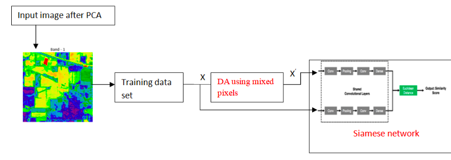

# HYPERSPECTRAL-IMAGE-CLASSFICIATION
IN THIS RESEARCH PROJECT, I HAVE PROPOSED A SIAMESE NETWORK BASED IMAGE CLASSIFICATION MODEL FOR DIFFERENT HYPERSPECTRAL IMAGE DATASETS. 

The Link to the Dataset is http://www.ehu.eus/ccwintco/index.php/Hyperspectral_Remote_Sensing_Scenes .

Link to the paper https://turcomat.org/index.php/turkbilmat/article/view/2731/2333

MODEL ARCHITECTURE

